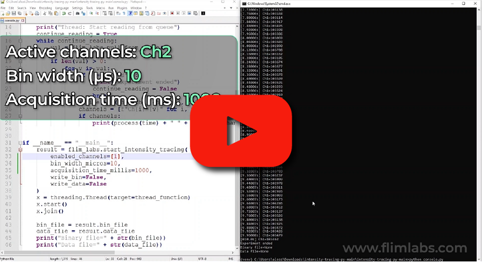

  <h1>Intensity Tracing - Console mode </h1>

  

 

<!-- TABLE OF CONTENTS -->

  
Table of Contents

  <ol>
    <li>
      <a href="#console-usage">Console Usage</a>
    </li>
    <li><a href="#useful-links">Useful links</a></li>
    <li><a href="#license">License</a></li>
    <li><a href="#contact">Contact</a></li>
  </ol>

## Console usage

The [Intensity Tracing](https://github.com/flim-labs/intensity-tracing-py) Console mode provides live-streaming data representation directly in the console, without an interface intermediary and charts data visualization processes.
The data displayed on the console screen indicates **the moment of acquisition** (in seconds) and the corresponding **number of photons** detected during that time for each **enabled channels**.

Here a table summary of the configurable parameters on code side:

|                           | data-type   | config                                                                            | default   | explanation                                                                               |
| ------------------------- | ----------- | --------------------------------------------------------------------------------- | --------- | ----------------------------------------------------------------------------------------- |
| `enabled_channels`        | number[]    | set a list of enabled acquisition data channels (up to 8). e.g. [0,1,2,3,4,5,6,7] | _[0]_       | the list of enabled channels for photons data acquisition                                 |
| `bin_width_micros`        | number      | Set the numerical value in microseconds                                           | _1 (μs)_ | the time duration to wait for photons count accumulation.                                 |
| `acquisition_time_millis` | number/None | Set the data acquisition duration                                                 | _10000 (ms_)      | The acquisition duration could be determinate (_numeric value_) or indeterminate (_None_) |
| `write_data`              | boolean     | Set export data option to True/False                                              | _True_      | if set to _True_, the acquired raw data will be exported locally to the computer          |
| `firmware_file`              | string     | Set the intensity tracing firmware input (USB or SMA)                                              | _intensity_tracing_usb.flim_     |     The firmware input used for the acquisition     |

 
(<a href="#readme-top">back to top</a>)

## Useful Links

For more details about the project follow these links:

- [Intensity Tracing introduction](../index.md)
- [Intensity Tracing GUI guide](../v1.7/index.md)
- [Intensity Tracing Data Export guide ](./intensity-tracing-file-format.md)

(<a href="#readme-top">back to top</a>)

## License

Distributed under the MIT License.

(<a href="#readme-top">back to top</a>)

<!-- CONTACT -->

## Contact

FLIM LABS: info@flimlabs.com

Project Link: [FLIM LABS - Intensity Tracing](https://github.com/flim-labs/intensity-tracing-py)

(<a href="#readme-top">back to top</a>)

