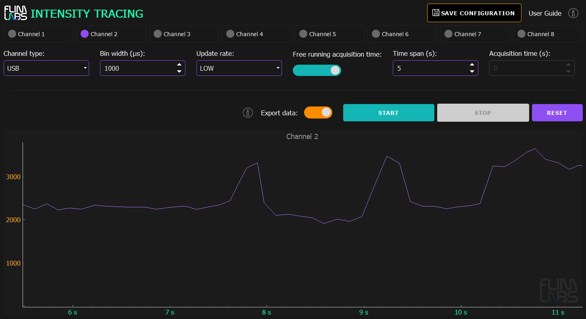
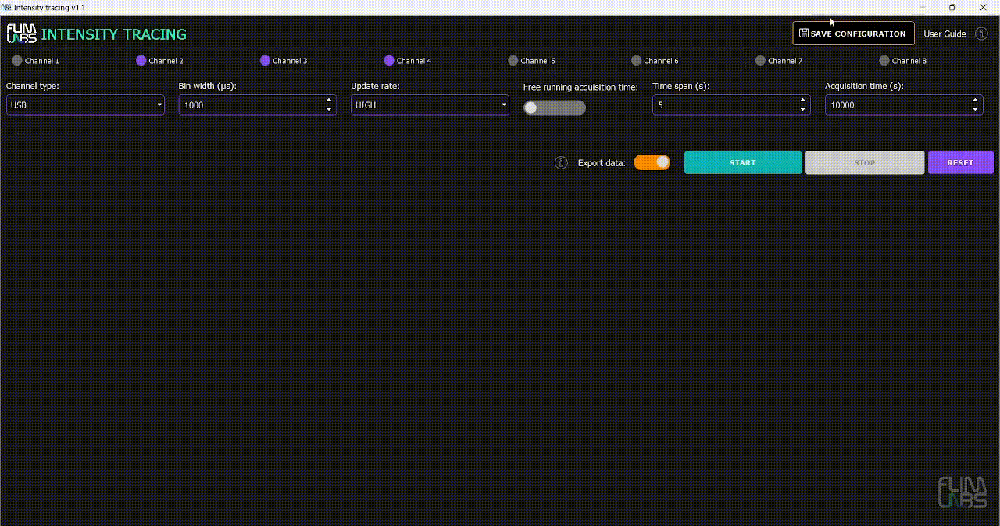

<a name="readme-top"></a>

<div align="center">
  <h1>Intensity Tracing v1.1</h1>
</div>
<div align="center">
  <a href="https://www.flimlabs.com/">
    
  </a>
</div>
<br>

<!-- TABLE OF CONTENTS -->
<details>
  <summary>Table of Contents</summary>
  <ol>
    <li>
      <a href="#introduction">Introduction</a>
    </li>
    <li><a href="#gui-usage">GUI Usage</a>
    <ul>
    <li><a href="#draw-frequency">Draw Frequency</a></li>
    <li><a href="#max-points">Max Points</a></li>
     <li><a href="#save-parameters-configuration">Save Parameters Configuration</a></li>
    </ul>
    </li>
    <li><a href="#console-usage">Console Usage</a></li>
     <li><a href="#exported-data-visualization">Exported Data Visualization</a></li>
    <li><a href="#license">License</a></li>
    <li><a href="#contact">Contact</a></li>
  </ol>
</details>

<!-- ABOUT THE PROJECT -->

## Introduction

Welcome to [FLIM LABS Intensity Tracing](https://github.com/flim-labs/intensity-tracing-py) _v1.1_ usage guide. In this documentation section, you will find all the necessary information for the proper use of the application's **graphical user interface** (GUI).
For a general introduction to the aims and technical requirements of the project, read the [Intensity Tracing Homepage](../index.md). You can also follow the [Console mode](../python-flim-labs/intensity-tracing-console.md) and [Data export](../python-flim-labs/intensity-tracing-file-format.md) dedicated guides links.

<p align="right">(<a href="#readme-top">back to top</a>)</p>

<!-- USAGE EXAMPLES -->

## GUI Usage

<div align="center">
    
</div>

The GUI mode provides advanced functionality for configuring analysis **parameters** and displaying live-streamed photon data. It allows simultaneous acquisition from up to **8 channels**, offering real-time data visualization in the form of plots:

- **X** Axis: represents _acquisition time_
- **Y** Axis: represents _photons intensity_

Here a table summary of the configurable parameters:

|                                 | data-type   | config                                                                                            | default   | explanation                                                                                                                                                                          |
| ------------------------------- | ----------- | ------------------------------------------------------------------------------------------------- | --------- | ------------------------------------------------------------------------------------------------------------------------------------------------------------------------------------ |
| `enabled_channels`              | number[]    | set a list of enabled acquisition data channels (up to 8). e.g. [0,1,2,3,4,5,6,7]                 | []        | the list of enabled channels for photons data acquisition                                                                                                                            |
| `selected_conn_channel`         | string      | set the selected connection type for acquisition (USB or SMA)                                     | "USB"     | If USB is selected, USB firmware is automatically used. If SMA is selected, SMA firmware is automatically used.                                                                      |
| `bin_width_micros`              | number      | Set the numerical value in microseconds. Range: _1-1000000µs_                                     | 1000 (µs) | the time duration to wait for photons count accumulation.                                                                                                                            |
| `selected_update_rate`          | string      | Set the chart update frequency (**"LOW"** or **"HIGH"**)                                          | "LOW"     | Based on the **selected_update_rate** value and the number of **enabled_channels** an algorithm determines the **draw_frequency** value assuring a balanced chart data visualization |
| `free_running_acquisition_time` | boolean     | Set the acquisition time mode (**True** or **False**)                                             | True      | If set to True, the _acquisition_time_millis_ is indeterminate. If set to False, the acquisition_time_millis param is needed (acquisition duration)                                  |
| `time_span`                     | number      | Time interval, in seconds, for the **visible data range** on the duration x-axis. Range: _1-300s_ | 5         | For instance, if `time_span` is set to _5s_, the _x-axis_ will scroll to continuously display the latest 5 seconds of real-time data on the chart                                    |
| `acquisition_time_millis`       | number/None | Set the data acquisition duration. Range: _1-10800s_                                              | None      | The acquisition duration is indeterminate (None) if _free_running_acquisition_time_ is set to True.                                                                                  |
| `write_data`                    | boolean     | Set export data option to True/False                                                              | False     | if set to _True_, the acquired raw data will be exported locally to the computer                                                                                                     |

<br/>

### Draw Frequency

The purpose of `set_draw_frequency` function is is to determine and set the charts drawing frequency based on certain conditions, taking into account the selected _update rate_ and the _number of enabled channels_.

- If the `selected_update_rate` is set to "LOW" the `draw_frequency` value will fall within a range between **5** and **20**, depending on the number of active channels.
- If the `selected_update_rate` is set to "HIGH" the `draw_frequency` value will fall within a range between **21** and **100**, depending on the number of active channels.

```python
def set_draw_frequency(self):
    num_enabled_channels = len(self.enabled_channels)

    # Set default draw frequency when no channels are enabled and update rate is not "LOW" or "HIGH"
    if self.selected_update_rate not in ["LOW", "HIGH"] and num_enabled_channels == 0:
        self.draw_frequency = 10
        return

    # Define minimum and maximum frequencies based on the selected update rate
    if self.selected_update_rate == "LOW":
        min_frequency = 5
        max_frequency = 20
    else:
        min_frequency = 21
        max_frequency = 100

    # Calculate the frequency range and step based on the number of enabled channels
    frequency_range = max_frequency - min_frequency
    step = frequency_range / num_enabled_channels

    # Adjust the frequency considering the number of enabled channels
    adjusted_frequency = max_frequency - step * (num_enabled_channels - 1)

    # Set the draw frequency within the specified range
    self.draw_frequency = max(min_frequency, min(max_frequency, adjusted_frequency))
```

<br>

### Max Points

At the core of the photon intensity tracking functionality lies the algorithm for calculating the **maximum displayable points** on the charts. This algorithm aims to optimize chart _clarity_ by preventing _overcrowding_ and ensuring an accurate visual representation of the acquired data.

```python
def calc_max_points(self):
    # Calculate the width of each bin in seconds
    bin_width_seconds = self.bin_width_micros / 1000000

    # Calculate the maximum number of points based on the bin width
    max_points_by_bin_width = int(self.time_span / bin_width_seconds)

    # Determine the time interval between each drawn point
    draw_interval = 1 / self.draw_frequency

    # Calculate the maximum number of points based on the selected draw frequency
    max_points_by_frequency = int(self.time_span / draw_interval)

    # Set the final number of points to keep, minimizing between bin width and draw frequency constraints
    self.keep_points = min(max_points_by_bin_width, max_points_by_frequency)
```

<br>

### Save Parameters Configuration

<div align="center">
    
</div>

Users can locally **save their parameter configuration** by clicking the ``SAVE CONFIGURATION`` button in the top-right corner of the GUI. The saved parameters include:

- ``enabled_channels``
- ``selected_conn_channel``
- ``selected_firmware``
- ``bin_width_micros``
- ``time_span``
- ``acquisition_time_millis``
- ``draw_frequency``
- ``free_running_acquisition_time``
- ``write_data``

The configuration file is stored as a JSON file at ``C:\Users\YOUR_USER\.flim-labs\config\intensity_tracing_config.json``. 
On application restart, the saved configuration is automatically loaded if the file is found; otherwise, a _default_ configuration is applied.

Here an example of the saved _json_ structure:

```json
{
  "selected_update_rate": "HIGH",
  "selected_conn_channel": "USB",
  "selected_firmware": "intensity_tracing_usb.flim",
  "bin_width_micros": 1000,
  "time_span": 5,
  "acquisition_time_millis": 10000000,
  "draw_frequency": 20,
  "free_running_acquisition_time": false,
  "write_data": true,
  "enabled_channels": [
    1,
    2,
    3
  ]
}
```

<p align="right">(<a href="#readme-top">back to top</a>)</p>

## Console Usage

For a detailed guide about console mode usage follow this link:

- [Intensity Tracing Console guide ](../python-flim-labs/intensity-tracing-console.md)

 <p align="right">(<a href="#readme-top">back to top</a>)</p>

## Exported Data Visualization 

The application GUI allows the user to export the analysis data in `binary file format`. For a detailed guide about data export and binary file structure see:

- [Intensity Tracing Data Export guide ](../python-flim-labs/intensity-tracing-file-format.md)

<p align="right">(<a href="#readme-top">back to top</a>)</p>

## License

Distributed under the MIT License.

<p align="right">(<a href="#readme-top">back to top</a>)</p>

<!-- CONTACT -->

## Contact

FLIM LABS: info@flimlabs.com

Project Link: [FLIM LABS - Intensity Tracing](https://github.com/flim-labs/intensity-tracing-py)

<p align="right">(<a href="#readme-top">back to top</a>)</p>
