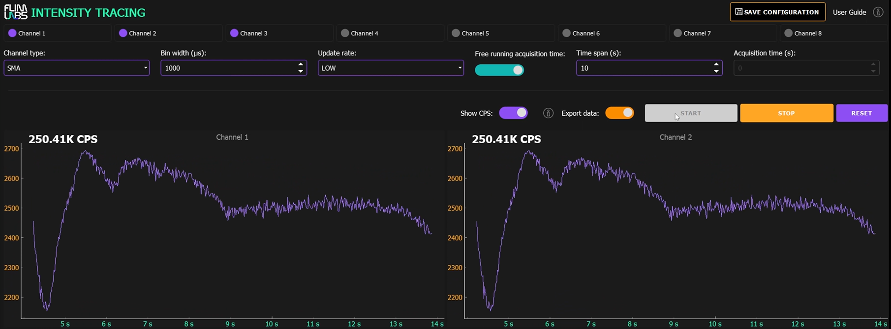

<a name="readme-top"></a>

<div align="center">
  <h1>Intensity Tracing v1.4</h1>
</div>
<div align="center">
  <a href="https://www.flimlabs.com/">
    
  </a>
</div>
<br>

<!-- TABLE OF CONTENTS -->
<details>
  <summary>Table of Contents</summary>
  <ol>
    <li>
      <a href="#introduction">Introduction</a>
    </li>
    <li><a href="#gui-usage">GUI Usage</a>
    <ul>
    <li><a href="#max-points-and-draw-frequency">Max Points and Draw Frequency</a></li>
     <li><a href="#parameters-configuration-saving">Parameters Configuration Saving</a></li>
    </ul>
    </li>
       <li><a href="#long-time-acquisitions-and-ring-buffers">Long Time Acquisitions and Ring Buffers</a></li>
    <li><a href="#console-usage">Console Usage</a></li>
     <li><a href="#exported-data-visualization">Exported Data Visualization</a></li>
     <li><a href="#download-acquired-data">Download Acquired Data</a></li>
    <li><a href="#license">License</a></li>
    <li><a href="#contact">Contact</a></li>
  </ol>
</details>

<!-- ABOUT THE PROJECT -->

## Introduction

Welcome to [FLIM LABS Intensity Tracing](https://github.com/flim-labs/intensity-tracing-py) _v1.4_ usage guide. In this documentation section, you will find all the necessary information for the proper use of the application's **graphical user interface** (GUI).
For a general introduction to the aims and technical requirements of the project, read the [Intensity Tracing Homepage](../index.md). You can also follow the [Console mode](../python-flim-labs/intensity-tracing-console.md) and [Data export](../python-flim-labs/intensity-tracing-file-format.md) dedicated guides links.

<p align="right">(<a href="#readme-top">back to top</a>)</p>

<!-- USAGE EXAMPLES -->

## GUI Usage

<div align="center">
    
</div>

The GUI mode provides advanced functionality for configuring analysis **parameters** and displaying live-streamed photon data. It allows simultaneous acquisition from up to **8 channels**, offering real-time data visualization in the form of plots:

- **X** Axis: represents _acquisition time_
- **Y** Axis: represents _photons intensity_

Here a table summary of the configurable parameters:

|                                 | data-type   | config                                                                                                                     | default   | explanation                                                                                                                                         |
| ------------------------------- | ----------- | -------------------------------------------------------------------------------------------------------------------------- | --------- | --------------------------------------------------------------------------------------------------------------------------------------------------- |
| `enabled_channels`              | number[]    | set a list of enabled acquisition data channels (up to 8). e.g. [0,1,2,3,4,5,6,7]                                          | []        | the list of enabled channels for photons data acquisition                                                                                           |
| `selected_conn_channel`         | string      | set the selected connection type for acquisition (USB or SMA)                                                              | "USB"     | If USB is selected, USB firmware is automatically used. If SMA is selected, SMA firmware is automatically used.                                     |
| `bin_width_micros`              | number      | Set the numerical value in microseconds. Range: _1-1000000µs_                                                              | 1000 (µs) | the time duration to wait for photons count accumulation.                                                                                           |
| `selected_update_rate`          | string      | Set the chart update frequency (_LOW_ or _HIGH_)                                                                           | "LOW"     | If `selected_update_rate` is configured as _LOW_, `draw_frequency` is set to _40Hz_. When set to _HIGH_, it is configured to _10Hz_.                |
| `free_running_acquisition_time` | boolean     | Set the acquisition time mode (_True_ or _False_)                                                                          | True      | If set to True, the _acquisition_time_millis_ is indeterminate. If set to False, the acquisition_time_millis param is needed (acquisition duration) |
| `time_span`                     | number      | Time interval, in seconds, for the visible data range on the duration x-axis. Range: _1-300s_                              | 5         | For instance, if `time_span` is set to _5s_, the _x-axis_ will scroll to continuously display the latest 5 seconds of real-time data on the chart   |
| `acquisition_time_millis`       | number/None | Set the data acquisition duration. Range: _1-1800s_                                                                        | None      | The acquisition duration is indeterminate (None) if _free_running_acquisition_time_ is set to True.                                                 |
| `output_frequency_ms`           | number      | Set the frequency, in milliseconds (time interval between successive acquired data points in the exported .bin data file). |           | If `selected_update_rate` is configured as _LOW_, `output_frequency_ms` is set to _100ms_. When set to _HIGH_, it is configured to _25ms_.          |
| `write_data`                    | boolean     | Set export data option to True/False                                                                                       | False     | if set to _True_, the acquired raw data will be exported locally to the computer                                                                    |
| `show_cps`                      | boolean     | Set show cps option to True/False                                                                                          | False     | if set to _True_, user can visualize cps value (average photon count per second) on charts for each active channel                                  |

<br/>

### Max Points and Draw Frequency

From _Intensity Tracing v.1.2_, there's a change in the calculation of **max points** and **draw frequency** on charts to prevent overload and overcrowding while maintaining real-time acquisition.

`draw_frequency` takes fixed values based solely on the `selected_update_rate`:

- If `selected_update_rate` is set to _LOW_, `draw_frequency` is **10Hz**.
- If `selected_update_rate` is set to _HIGH_ ,`draw_frequency` is **40Hz**.

Similarly, the `max_points` value is recalibrated to ensure clarity and speed in chart rendering. It no longer depends on _bin_width_micros_ but solely on `selected_update_rate` and `time_span`:

- If `selected_update_rate` is _LOW_, `max_points` is set to **10 \* time_span**.
- If `selected_update_rate` is _HIGH_, `max_points` is set to **40 \* time_span**.

This recalibration on the data visualization side doesn't affect the acquisition of all points during data reading and export in .bin format, thanks to the combination of `bin_width_micros` and `output_frequency_ms` values.

<br>

### Parameters Configuration Saving
Starting from _Intensity Tracing v.1.4_, the saving of GUI configuration parameters has been **automated**. Each interaction with the parameters results in the relative value change being stored in a `settings.ini` internal file. 

The configurable parameters which can be stored in the settings file include:

- `enabled_channels`
- `selected_conn_channel`
- `selected_firmware`
- `bin_width_micros`
- `time_span`
- `acquisition_time_millis`
- `draw_frequency`
- `free_running_acquisition_time`
- `write_data`
- `show_cps`

On application restart, the saved configuration is automatically loaded. If the `settings.ini` file is not found, or a specific parameter has not been configured yet, a default configuration will be set.


Here an example of the `settings.ini` structure:

```json
[General]
show_cps=true
free_running_mode=false
acquisition_time_millis=100000
bin_width_micros=2000
enabled_channels="[0, 1, 2]"
update_rate=HIGH
draw_frequency=40
acquisition_stopped=true
write_data=true
time_span=10
```

<p align="right">(<a href="#readme-top">back to top</a>)</p>

## Long Time Acquisitions and Ring Buffers

The software employs **ring buffers** to ensure seamless long-time acquisition of photon counts. A ring buffer, also known as a circular buffer, is utilized for efficient handling of cyclic data streams.

A ring buffer is a data structure implemented as a circular array, allowing continuous and cyclic storage of data. It is particularly useful when dealing with repetitive data streams without the need to fill or empty the entire buffer at once. This characteristic makes it well-suited for scenarios requiring constant data access and management.

It's important to note that, due to the continuous nature of long-time acquisition, the system may consume a significant amount of RAM. In practice, for extended acquisition sessions, we estimate a potential consumption of up to **4 gigabytes of RAM**. Users should be mindful of their system's memory capabilities to ensure smooth operation during extended experiments.

<p align="right">(<a href="#readme-top">back to top</a>)</p>

## Console Usage

For a detailed guide about console mode usage follow this link:

- [Intensity Tracing Console guide ](../python-flim-labs/intensity-tracing-console.md)

 <p align="right">(<a href="#readme-top">back to top</a>)</p>

## Exported Data Visualization

The application GUI allows the user to export the analysis data in `binary file format`. 

The user can also preview the final file size on the GUI. Since the calculation of the size depends on the values of the parameters `enabled_channels`, `bin_width_micros`, `free_running_acquisition_time`, `time_span`, and `acquisition_time_millis`, the value will be displayed if the following actions have been taken:
- At least one acquisition channel has been activated (`enabled_channels` has a length greater than 0).
- Values have been set for `time_span`, `acquisition_time_millis`, and `bin_width_micros`.

Here is a code snippet which illustrates the algorithm used for the calculation:

```python
def calc_exported_file_size(self):
  if self.free_running_acquisition_time is True or self acquisition_time_millis is None:
    file_size_bytes = int(EXPORTED_DATA_BYTES_UNIT *
    (1000 / self.bin_width_micros) * len(self.enabled_channels))
    self.bin_file_size = FormatUtils.format_size(file_size_bytes)
    self.bin_file_size_label.setText("File size: " + str(self.bin_file_size) + "/s")
  else:  
    file_size_bytes = int(EXPORTED_DATA_BYTES_UNIT *
    (self.acquisition_time_millis / 1000) *
    (1000 / self.bin_width_micros) * len(self.enabled_channels))
    self.bin_file_size = FormatUtils.format_size(file_size_bytes)
    self.bin_file_size_label.setText("File size: " + str(self.bin_file_size))
```

where `EXPORTED_DATA_BYTES_UNIT` is equal to the constant value of **12083.2 bytes**.

For a detailed guide about data export and binary file structure see:
- [Intensity Tracing Data Export guide ](../python-flim-labs/intensity-tracing-file-format.md)

<p align="right">(<a href="#readme-top">back to top</a>)</p>

## Download Acquired Data

Besides the [Exported Data Visualization](#exported-data-visualization) feature, users can download raw data and its reader file by clicking the `DOWNLOAD` button in the top-right corner of the GUI.

During the download, users need to choose the preferred reader file format (`MATLAB` (.m) or `Python` (.py)) and specify a directory for saving both the `.bin` file and its corresponding reader file. It's important to provide a specific name before completing the save operation.

After downloading, visualize the raw data by running the saved script (reader file). This script reads binary data from the locally stored file and uses the [matplotlib](https://matplotlib.org/) library to create a graphical representation of photon intensity information.

For more details on how to run the saved script. data export and binary file structure and refer to: [Intensity Tracing Data Export guide ](../python-flim-labs/intensity-tracing-file-format.md)

<p align="right">(<a href="#readme-top">back to top</a>)</p>

## License

Distributed under the MIT License.

<p align="right">(<a href="#readme-top">back to top</a>)</p>

<!-- CONTACT -->

## Contact

FLIM LABS: info@flimlabs.com

Project Link: [FLIM LABS - Intensity Tracing](https://github.com/flim-labs/intensity-tracing-py)

<p align="right">(<a href="#readme-top">back to top</a>)</p>
